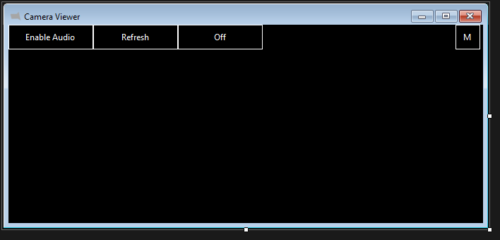

# RTSP Stream / Camera Viewer.

The primary purpose of this is to be used as a camera viewer.  
Displays multiple video streams in a grid with quick one click fullscreen access.  

## Features  
- Uses VLC Library LibVLCSharp v3.  
- Support for Windows and Linux.  
- Auto sizes grid to fill window.

  

## Setup  
Configured using a config.ini file.  
Add video streams using:  
camera=rtsp://1.2.3.4:554/s0  

You can overide the default 3 columns for the grid with:  
maxcols=4  

## SQL Integration  
Camera feed source can be queried from SQL Server using sqlconfig.ini  
First line is connection string, second the query that should return the feed and rotation value.  

Data Source=testserver,1433;Initial Catalog=TestDb;Integrated Security=true;TrustServerCertificate=True;  
SELECT rtspfeed,rotatedegrees from tblCameras ORDER BY displayorder_console ASC  