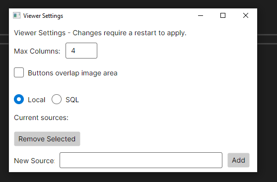

# RTSP Stream / Camera Viewer.

The primary purpose of this is to be used as a camera viewer.  
Displays multiple video streams in a grid with quick one click fullscreen access.  

## Features  
- Uses VLC Library LibVLCSharp v3.  
- Support for Windows and Linux.  
- Auto sizes grid to fill window.
- Rotation Supported (90,180,270 Degrees)

## Setup  
Add video streams using the settings tool.
Example source path is: rtsp://1.2.3.4:554/s0  

  

## SQL Feed Integration  
Camera feed source can be queried from SQL Server.

Example Connection String:
Data Source=testserver,1433;Initial Catalog=TestDb;Integrated Security=true;TrustServerCertificate=True;  

Example Connection String, expected return is the source and rotation in degrees.
SELECT rtspfeed,rotatedegrees from tblCameras ORDER BY displayorder_console ASC  